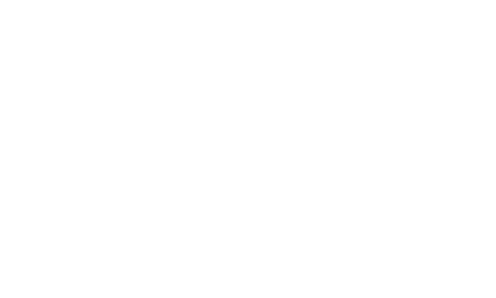

> [!IMPORTANT]
> My professional and academic journey started with a Physics degree at UFRPE, marked by a passion for solving complex problems. I excelled academically, becoming valedictorian, reflecting dedication and purpose. A research project on inextensible balloons using Visual Python opened the door to technology. After graduation, I expanded my programming skills at the School of Aeronautics Specialists, developing an app for air traffic controllers, which received recognition. Returning to Recife, I deepened my knowledge in JavaScript and Google Apps Script, creating impactful data management solutions. Currently, I’m transitioning to tech, working on flight data analysis in Northeast aviation, eager to innovate and make a difference.


<div align="center">
    <div align="center">
        <a href="https://oxedev.com.br">
            
        </a>
    </div>

My personal Portifólio, built with [Next.js](https://nextjs.org/), [Tailwind CSS](https://tailwindcss.com/), [Upstash](https://upstash.com?ref=oxedev.com.br), [Contentlayer](https://www.contentlayer.dev/) and deployed to [Vercel](https://vercel.com/).

</div>

<br/>


## Running Locally


```sh-session
git clone https://github.com/italomagno/oxe-dev.git
```


Then install dependencies and run the development server:
```sh-session
pnpm install
pnpm dev
```


## Cloning / Forking

Please remove all of my personal information (projects, images, etc.) before deploying your own version of this site.


## Credits

This project was inspired by chronark.com. Special thanks to the author for providing a lot of ideas and inspiration for this project.

